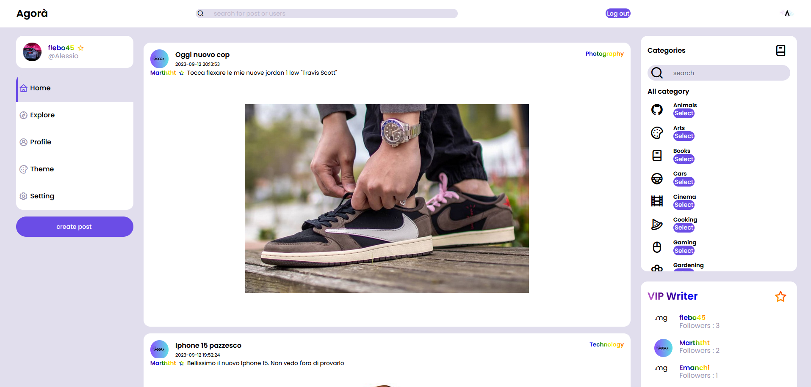
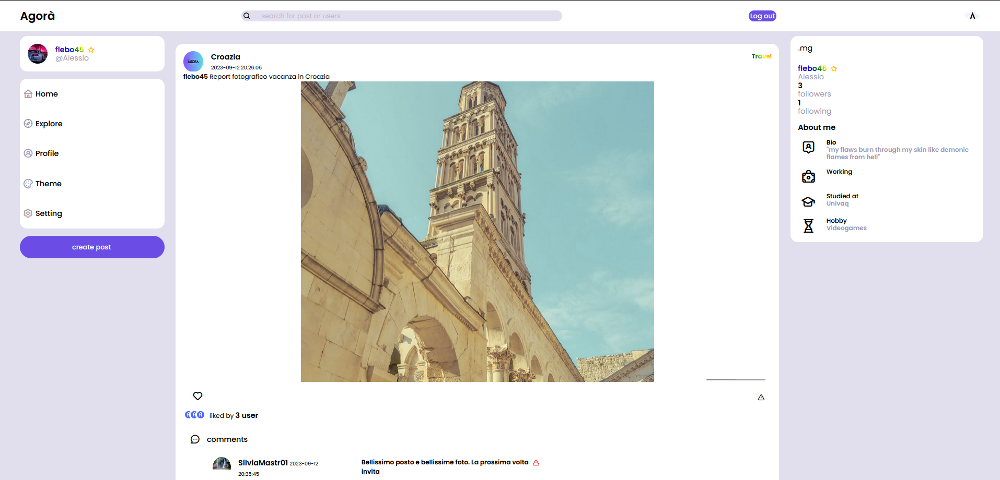

# Agora - The Social Netwok



# Table of Contents

1. [About](#about)
1. [Key Feature](#key-feature)
1. [Requirements](#requirements)
1. [Installation Guide](#installation-guide)
1. [Usage](#usage)
1. [Our Development Team](#our-development-team)

## About

Agora is a Web Application project for the "Web Programming" exam for Univaq(IT).

Agora is a Social Network that utilizes PHP, Doctrine ORM and Smarty.

This app would is intended as a project to lean how to design web applications, using the principles of the **MVC Pattern** and show the potential of our team in the engineering field.

## Key Feature

Agorà is a Social Network Web Application, in which users can share their experience, mood, hobby, thoughts and much more.
The "Agora" in the Ancient Greek city was a central public space. It is the best representation of a city-state's response to accomodate the social and the political order of the polis.
We took inspiration from this for our application.
Every user can create Post and enrich it with photos. But as everythings in the life, there is competition: Top 3 Users (users with the most follower) will be VIP Users.



## Requirements

Installation on local server requirements:

1. Install xampp ([XAMPP Download](https://www.apachefriends.org/it/download.html)) on your machine (inlcluding php)
1. Install composer([Composer Download](https://getcomposer.org/download/)) on your machine

## Installation Guide

1. Download the git repository;
1. Move the repositoy under `htdocs/` folder in Xampp and rename the folder `Agora`

1. Now you need to install [Doctrine ORM](https://www.doctrine-project.org/), to do that you need to open terminal in the folder of your application (that will be in `xampp/htdocs/Agora`) and run `composer install` in the prompt

1. Once you installed DoctrineORM, you need to modify some code in `vendor/` folder; in `vendor/doctrine/orm/src/Configuration.php' at line 170 approximately there is a function called `newDefaultAnnotationDriver`. You have to modify it like this:

```Configuration.php
public function newDefaultAnnotationDriver($paths = [], $useSimpleAnnotationReader = false, bool $reportFieldsWhereDeclared = false)
    {
        Deprecation::trigger(
            'doctrine/orm',
            'https://github.com/doctrine/orm/pull/9443',
            '%s is deprecated, call %s::createDefaultAnnotationDriver() instead.',
            __METHOD__,
            ORMSetup::class
        );

        if (! class_exists(AnnotationReader::class)) {
            throw new LogicException(
                'The annotation metadata driver cannot be enabled because the "doctrine/annotations" library'
                . ' is not installed. Please run "composer require doctrine/annotations" or choose a different'
                . ' metadata driver.'
            );
        }

            $reader = new AnnotationReader();

        if (class_exists(ArrayCache::class) && class_exists(CachedReader::class)) {
            $reader = new CachedReader($reader, new ArrayCache());
        }

        return new AnnotationDriver(
            $reader,
            (array) $paths,
            $reportFieldsWhereDeclared
        );
    }
```

1. In the application you can find a folder called `config`, in this folder locate a file called `config.php` and change the parameters according to your xampp and mysql settings

1. Now it's all setup open your browser and digit in the URL `localhost/Agora` and enjoy the application

1. _Doctrine Usage And App Info_ For Doctrine usage there is a `README.md` file in the `config` folder

1. _For Linux Users Only_ To make the application work on your terminal you must enable write, read and execute permissions on all the files present in the application. I recommend using `chmod -R a+rwe path-to-Agora-directory` command to eneable all the permission.Check that all files inside the folders have all permissions enabled. If they don't have them you can use the previous command directly on the affected folders. Check especially if the folder (and files) found in `libs/Smarty/templates_c` have the right permission. Once you set all the permissions everything should work.

## Usage

### Doctrine and SQL

This application contains two instances of the "Agora" app: one that uses ORM technologies and one that uses standard SQL. In the `config` folder you can find the guide on how to switch between apps.

### Moderator View

This app also has the "Moderator View". In the root folder you will find a file called `admin.php`: this file allows you to add a moderator in the application (of course you can change the parameters as you like, and you have to run the script). Once you have added a moderator, to access the moderator view, you have to access the page `localhost/Agora/Moderator/login` and enter the credentials you have set.

### WebSocket

Among the technologies used there are also those related to WebSockets. These add extra features to the application, such as seeing how many users are online or the real-time location of an online user and much more. To enable these features you need to run the `websocket_server.php` script and leave it in the background. Since the application is installed locally, to take advantage of these features, one way is to run Agora on two different browsers with two different users and test the various features.

## Our Development team

- [flebo45](https://github.com/flebo45)
